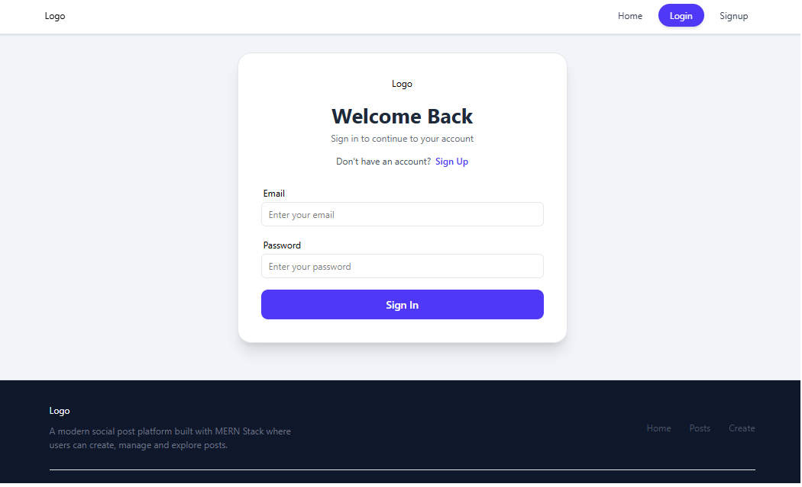
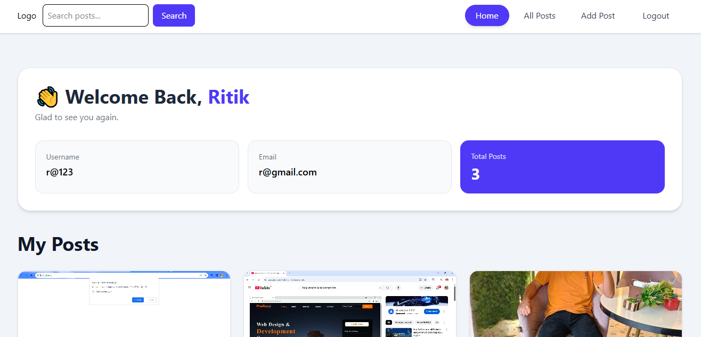
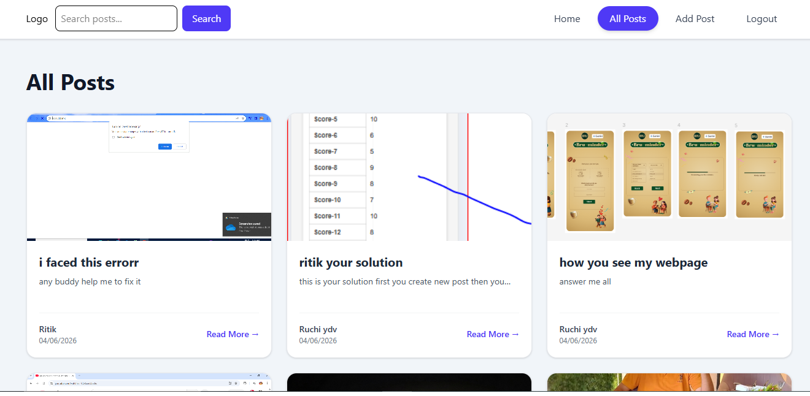
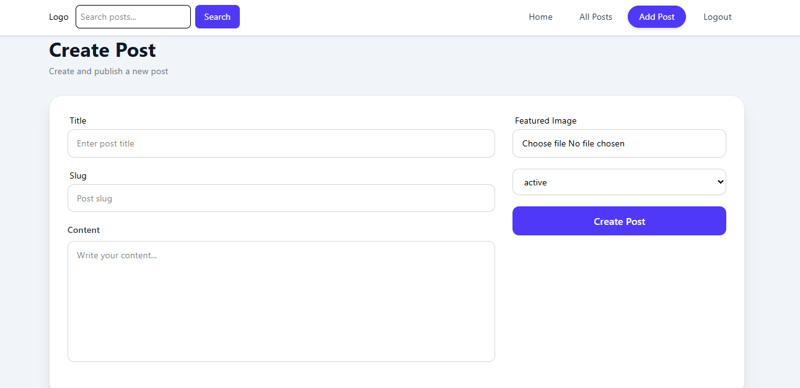
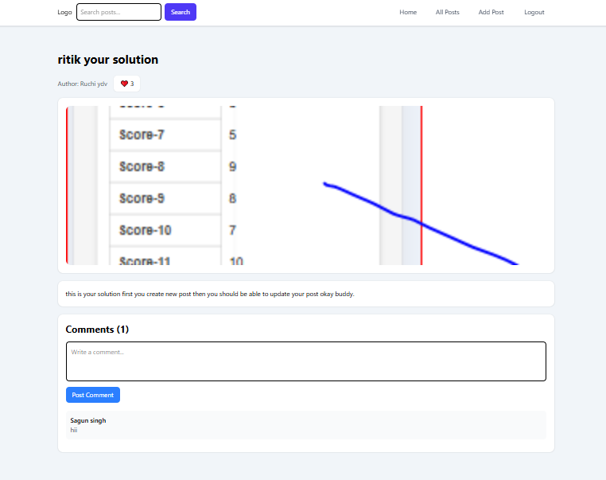

# social-post-platform
A full-stack social media platform built using the MERN stack that enables users to create, manage, search, and interact with posts. The application features JWT-based authentication, secure cookie-based sessions, image uploads with Cloudinary, post likes and comments, search and pagination, Redux Toolkit state management, and a responsive user interface for seamless user experience across devices.

## Live Demo

🌐 Live Demo: https://social-post-platform.vercel.app

## Features

- JWT Authentication
- Secure Cookie-Based Authentication
- Create, Edit and Delete Posts
- Image Upload and Storage using Cloudinary
- Comment Management System
- Like Functionality
- Search Functionality
- Pagination
- User Profile Management
- Redux Toolkit State Management
- Responsive Design

## Tech Stack

### Frontend
- React.js
- Redux Toolkit
- Tailwind CSS

### Backend
- Node.js
- Express.js

### Database
- MongoDB

### Services

- Cloudinary (Image Storage & Management)  

## Screenshots

### Login Page


### User Dashboard


### All Posts


### Create Post


### Post Details & Comments


## Folder Structure

```text
social-post-platform/
│
├── Backend/
│   ├── src/
│   │   ├── controllers/
│   │   ├── db/
│   │   ├── middlewares/
│   │   ├── models/
│   │   ├── routes/
│   │   ├── utils/
│   │   ├── app.js
│   │   ├── constants.js
│   │   └── index.js
│   │
│   ├── public/
│   ├── package.json
│   └── .env
│
├── Frontend/
│   ├── src/
│   │   ├── assets/
│   │   ├── Components/
│   │   ├── Pages/
│   │   ├── Store/
│   │   └── App.css
│   │
│   ├── public/
│   ├── package.json
│   └── dist/
│
└── README.md
```

## Installation

### Clone Repository

```bash
git clone https://github.com/Ritikyadav7830/social-post-platform.git
```

### Frontend

```bash
cd Frontend
npm install
npm run dev
```

### Backend

```bash
cd Backend
npm install
npm start
```

## Future Enhancements

- Real-time notifications
- Follow/Unfollow users
- Real-time chat

## Author

Ritik Yadav
